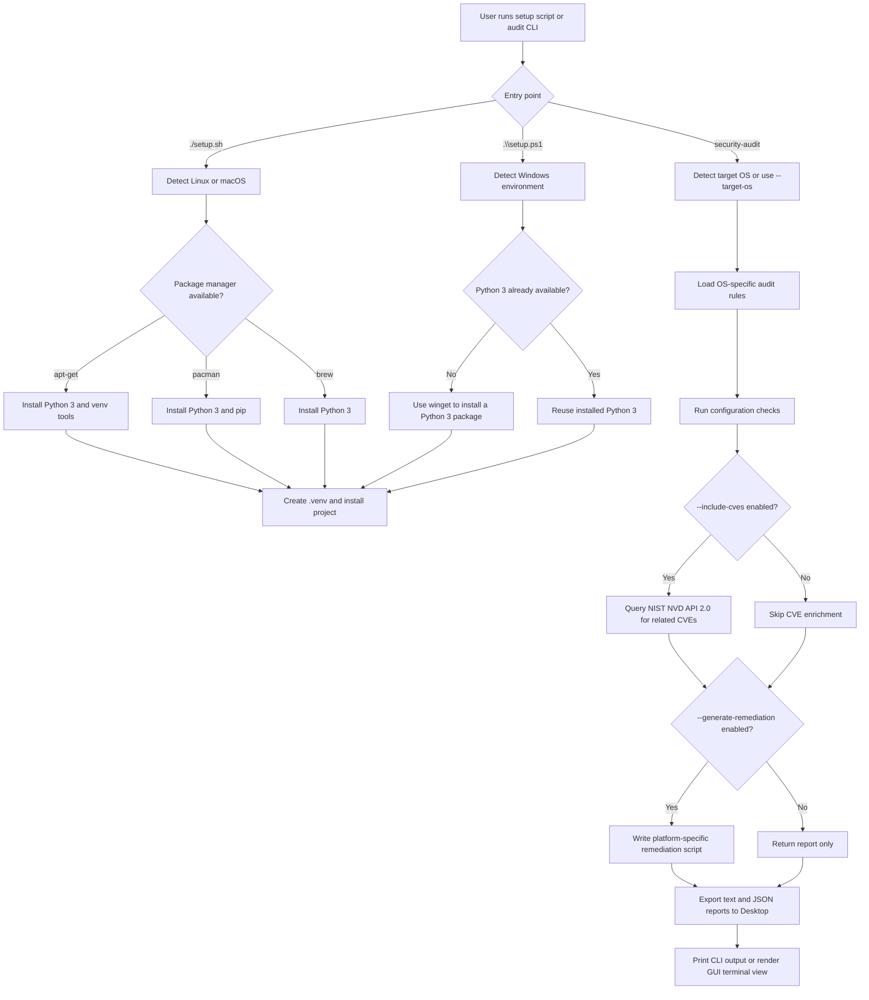

# Security Audit Tool

A cross-platform command-line tool for auditing baseline system security settings on Linux, macOS, and Windows. The project evaluates common hardening controls, optionally enriches failed findings with related CVEs from the NIST National Vulnerability Database (NVD), and can generate remediation scripts for operator review.

The project now includes a cross-platform GUI with a retro terminal-style interface. Every completed scan can automatically export the final report bundle to the current user's Desktop.

## Overview

This project is designed to support security configuration reviews with a simple workflow:

- Detect the target operating system
- Run OS-specific configuration checks
- Flag failed or skipped controls
- Optionally query NIST NVD for related vulnerabilities
- Generate a remediation script for failed findings
- Save the final report bundle to Desktop

The tool is intended for security assessment and hardening support. It does not assume that a local misconfiguration directly maps to a specific CVE. CVE enrichment is best understood as related vulnerability context.

## Supported Checks

| Platform | Checks |
| --- | --- |
| Linux | Firewall status, SSH root login, SSH password authentication, automatic updates |
| macOS | Firewall status, FileVault status, Remote Login status, automatic updates |
| Windows | Firewall profiles, BitLocker status, Remote Desktop status, Defender real-time monitoring |

## How It Works



## Project Structure

| Path | Purpose |
| --- | --- |
| `setup.sh` | Bootstrap script for Linux and macOS |
| `setup.ps1` | Bootstrap script for Windows |
| `security_audit_tool/cli.py` | CLI entry point and report rendering |
| `security_audit_tool/gui.py` | Retro terminal-style Tkinter GUI |
| `security_audit_tool/reporting.py` | Shared report rendering and Desktop export |
| `security_audit_tool/system_checks.py` | OS detection and audit rules |
| `security_audit_tool/nvd.py` | NIST NVD CVE API integration |
| `security_audit_tool/remediation.py` | Remediation script generation |
| `tests/test_security_audit_tool.py` | Basic unit coverage |

## Installation

### Option 1: Bootstrap with Native Package Manager

The setup scripts accept any installed Python 3 interpreter. If Python 3 is not available, they install it using the host package manager and then create a local virtual environment.

#### Linux or macOS

```bash
chmod +x ./setup.sh
./setup.sh
```

Supported package managers:

- Linux: `apt-get`, `pacman`
- macOS: `brew`

#### Windows PowerShell

If PowerShell blocks local script execution, allow the setup script first.

Temporary for the current shell only:

```powershell
Set-ExecutionPolicy -Scope Process -ExecutionPolicy Bypass
```

Persistent for the current user:

```powershell
Set-ExecutionPolicy -Scope CurrentUser -ExecutionPolicy RemoteSigned
```

Then run:

```powershell
.\setup.ps1
```

Supported package manager:

- Windows: `winget`

### Option 2: Manual Setup

If Python 3 is already installed, the project can be installed manually.

#### Linux or macOS

```bash
python3 -m venv .venv
source .venv/bin/activate
pip install -e .
```

#### Windows PowerShell

If activation is blocked, allow local signed and local scripts for the current user:

```powershell
Set-ExecutionPolicy -Scope CurrentUser -ExecutionPolicy RemoteSigned
```

Then run:

```powershell
py -3 -m venv .venv
.\.venv\Scripts\Activate.ps1
pip install -e .
```

## Executables

The project installs two executables so users can run either interface directly after setup.

| Executable | Interface | Purpose |
| --- | --- | --- |
| `security-audit` | CLI | Run audits from the terminal, use flags, and integrate with scripts or automation |
| `security-audit-gui` | GUI | Launch the retro terminal-style desktop application for interactive use |

## Usage

### Basic Audit

Audit the current host using automatic OS detection:

```bash
security-audit
```

### Save Reports to Desktop

```bash
security-audit --save-to-desktop
```

### JSON Output

```bash
security-audit --format json
```

### Include Related CVEs

```bash
security-audit --include-cves
```

### Generate Remediation Script

```bash
security-audit --generate-remediation
```

### Full Example

```bash
security-audit --include-cves --generate-remediation --format json
```

### Launch the GUI Executable

```bash
security-audit-gui
```

The GUI uses a retro terminal-style interface and automatically exports the final text and JSON reports to `Desktop/SecurityAuditReports/` after each completed scan.

### Explicit Target Ruleset

```bash
security-audit --target-os linux
security-audit --target-os macos
security-audit --target-os windows
```

## Output

The tool supports two output modes:

- `text`: human-readable report for local review
- `json`: structured output for automation or pipeline integration

When remediation generation is enabled, the tool writes a platform-specific script into the `artifacts/` directory:

- Linux: `artifacts/remediate_linux.sh`
- macOS: `artifacts/remediate_macos.sh`
- Windows: `artifacts/remediate_windows.ps1`

Report bundle export location:

- Linux: `~/Desktop/SecurityAuditReports/`
- macOS: `~/Desktop/SecurityAuditReports/`
- Windows: `%USERPROFILE%\Desktop\SecurityAuditReports\`

## CVE Enrichment

The tool uses the official NIST NVD CVE API 2.0 to retrieve related vulnerability records for failed checks.

- Source: [NVD Vulnerabilities API](https://nvd.nist.gov/developers/vulnerabilities)
- Optional API key: set `NVD_API_KEY`

Important limitations:

- CVE matching is heuristic and keyword-based
- Returned CVEs are related security context, not definitive proof that the host is vulnerable
- Network access is required when `--include-cves` is enabled

## Security and Operational Notes

- Review remediation scripts before executing them
- Some checks require elevated privileges to read accurate system state
- Some remediations require administrative or root access
- Project metadata currently supports Python `3.7+`

## Testing

Run the test suite with:

```bash
python3 -m unittest discover -s tests
```

## License

This repository currently does not include a standalone license file. Add one before external distribution if you need explicit licensing terms.
